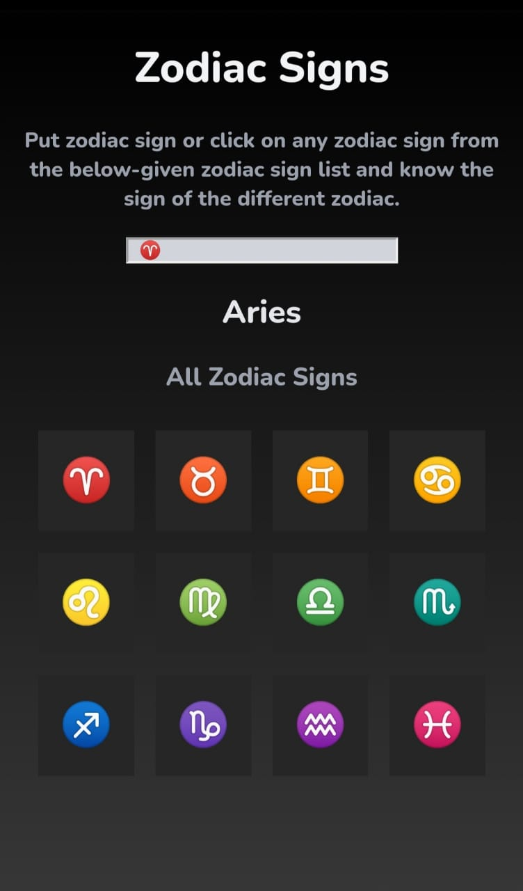

# Zodic-Sign
This is a web application which helps to know about zodiac sign symbols

# Motivation
The motivation behind creating this project is [neogcamp](https://neog.camp/)

# Visuals

# Tech used
* html
* css
* react

# Tool used
 [codesandbox](https://codesandbox.io/s/h1t13?file=/src/styles.css)
 
# Usage
* [Go to this link](https://h1t13.csb.app/)
* put your sign in input box or click on any sign from the list
* you will get to know the name of the zodiac sign 
